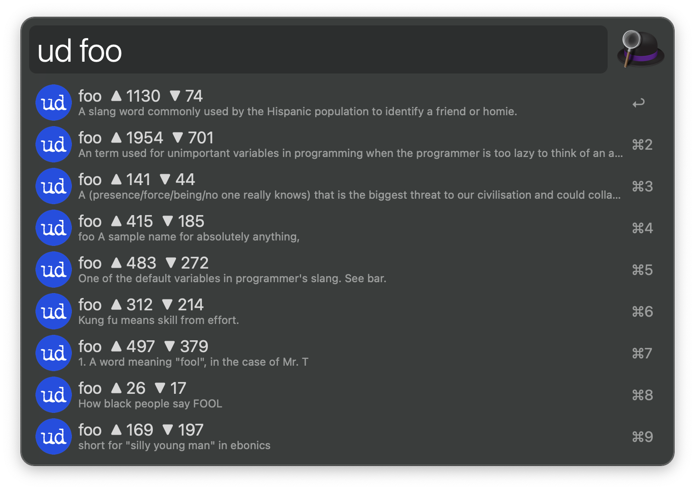

<h1 align="center">Urban Dictionary</h1>

  
  
  
  
  
  

  

An [Alfred][1] workflow to search Urban Dictionary.

## Usage

Search Urban Dictionary definitions via the `ud` keyword.

When displaying the results, <kbd>↩&#xFE0E;</kbd> opens the page for the term on
Urban Dictionary website, and <kbd>⌘</kbd><kbd>↩&#xFE0E;</kbd> shows the
selected definition in [Large Type][2].

## Contribute

To report a bug or request a feature, please [create an issue][3] or
[submit a pull request][4].

[1]:http://www.alfredapp.com/
[2]:https://www.alfredapp.com/help/features/large-type/
[3]:https://github.com/xilopaint/alfred-urban-dictionary/issues
[4]:https://github.com/xilopaint/alfred-urban-dictionary/pulls
