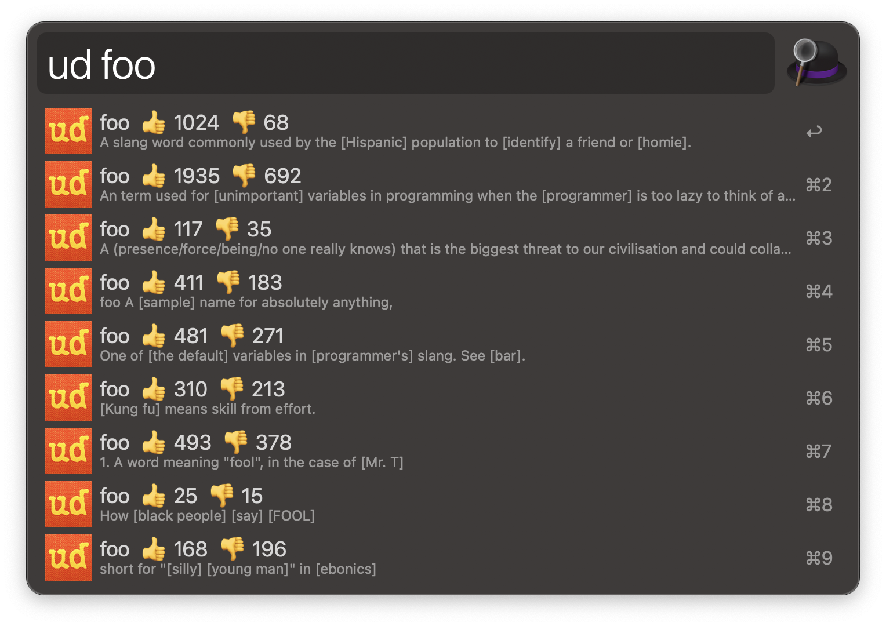

# Urban Dictionary for Alfred

A workflow for [Alfred][1].

## Download and Installation

Download the workflow file from [GitHub releases][2] and install it by double-clicking on `Urban.Dictionary.alfredworklow`.

## Usage

**Urban Dictionary** workflow can be used by the `ud` keyword.

## Credits

This workflow relies on [Alfred-Workflow][3] library by Dean Jackson and [OneUpdater][4] by Vítor Galvão..

## License

**Urban Dictionary** workflow code is released under the [MIT License][5].

[1]:http://www.alfredapp.com/
[2]:https://github.com/xilopaint/alfred-urban-dictionary/releases/latest
[3]:https://github.com/deanishe/alfred-workflow
[4]:https://github.com/vitorgalvao/alfred-workflows/tree/master/OneUpdater
[5]:https://opensource.org/licenses/MIT
